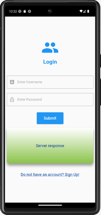
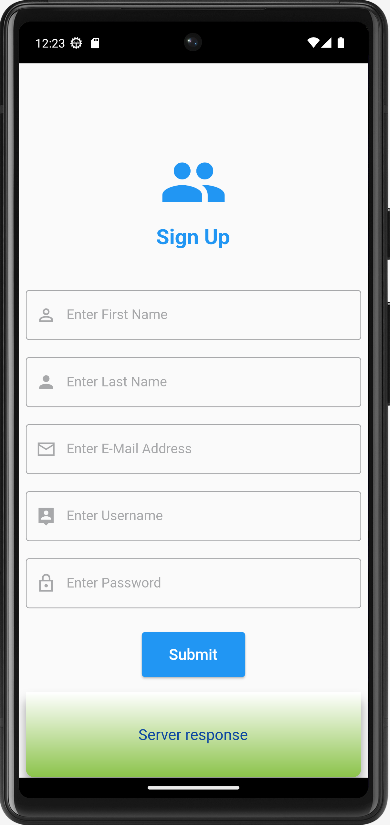

 # Reg-and-Log-System-Flutter
Registration and Login System created with Flutter
  
  
The files provided in this repository can be used to create applications
  
or games that require user registration and login. The data sent with
  
registration is saved in a database and can be retrieved through login.
  
  
This example can be applied on a hosting site that has PhpMyAdmin, 
  
MySQL and Sendmail function such as altervista.org.
  
The codes of the <b>login.php</b>, <b>register.php</b> and <b>active.php</b> files, which 
  
 must be uploaded to the server, must be modified as indicated in each file.
  
  
Software Versions Used:
  
Android Studio Giraffe | 2022.3.1 Patch 2
 
Hosting site: altervista.org
 # Guide to creating and developing apps for the web and Android smartphones.
Open Android Studio and create a New Flutter Project by clicking on the
  
appropriate button which will start the wizard.
  
  
Copy the codes from the <b>main.dart</b> and <b>pubspec.yaml</b> files and paste them into
  
the respective files in your Flutter project.
  
  
Edit the lines of code within the <b>main.dart</b> file where indicated by the two comments.
  
Remember to change the name inside the <b>pubspec.yaml</b> file and the label inside
  
the <b>AndroidManifest.xml</b> file if you have called your project with a name other than "database".
  
  
The Android Manifest XML file that is generated, when you create a new
  
Flutter project with Android Studio, is located in the path
  
YOUR_APPLICATION_FOLDER\android\app\src\main\AndroidManifest.xml.
  
  
To this file you need to add the following lines of code:
  
\<uses-permission android:name="android.permission.INTERNET"/\>
  
android:usesCleartextTraffic="true"
  
as shown in the AndroidManifestXml_LOCATION_AND_LINES_TO_ADD.png image
  
found in this repository.
  
  

