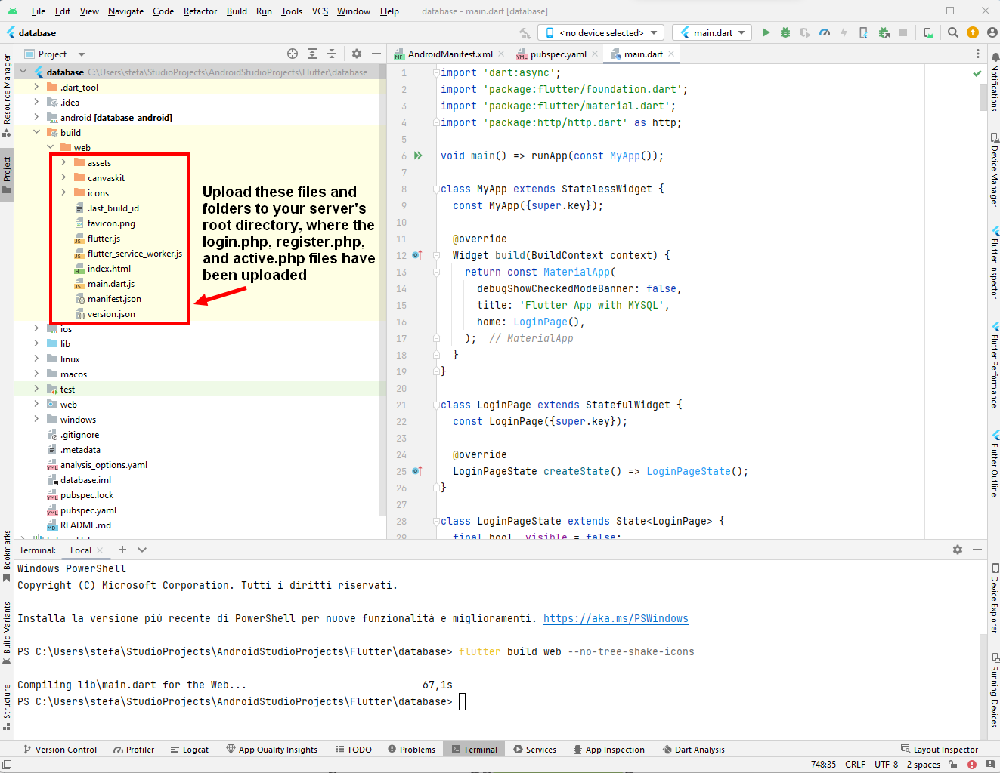
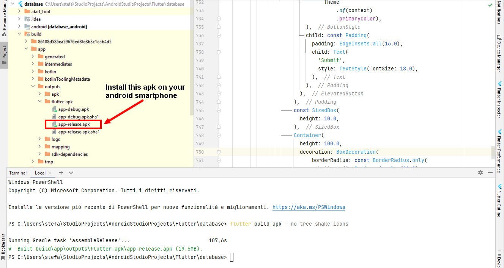
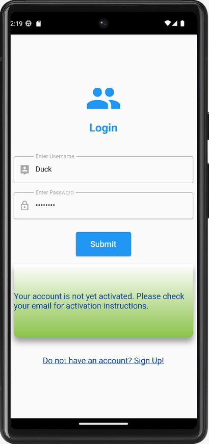
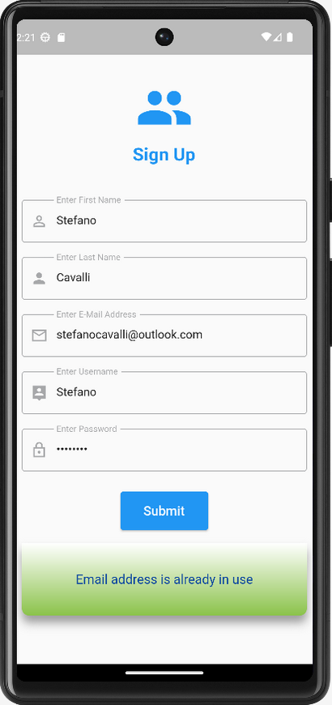

# Reg-and-Log-System-Flutter
Registration and Login System created with Flutter.
  
  
The files provided in this repository can be used to create applications or games that require user registration and login.
  
The data sent with registration is saved in a database and can be retrieved through login.
  
  
This example can be applied on a hosting site that has PhpMyAdmin, MySQL and Sendmail function such as altervista.org.
  
The codes of the <b>login.php</b>, <b>register.php</b> and <b>active.php</b> files, which must be uploaded to the server, must be modified as indicated in each file.
  
  
<b>Software used:</b>
  
Android Studio Giraffe | 2022.3.1 Patch 2
  
Hosting site: altervista.org
# Guide to creating and developing the app
Open Android Studio and create a New Flutter Project by clicking on the appropriate button which will start the wizard.
  
  
Copy the codes from the <b>main.dart</b> and <b>pubspec.yaml</b> files and paste them into the respective files in your Flutter project.
  
  
Edit the lines of code within the <b>main.dart</b> file where indicated by the two comments.
  
Remember to change the name inside the <b>pubspec.yaml</b> file and the label inside the <b>AndroidManifest.xml</b> file if you have called your project with a name other than "database".
  
The <b>Android Manifest XML</b> file that is generated, when you create a new Flutter project with Android Studio, is located in the path:
 
<i>YOUR_APPLICATION_FOLDER\android\app\src\main\AndroidManifest.xml.</i>
  
  
To this file you need to add the following lines of code:
  
<i>\<uses-permission android:name="android.permission.INTERNET"/\></i>
  
<i>android:usesCleartextTraffic="true"</i>
  
as shown in the <b>AndroidManifestXml_LOCATION_AND_LINES_TO_ADD.png</b> image found in this repository.
  
  
Upload the modified <b>login.php</b>, <b>register.php</b> and <b>active.php</b> files to the server.
  
  
Login to PhpMyAdmin and use the code found in the <b>createTables.sql</b> file on this repository to create the tables on the database with the available SQL tool.
# Data security and encryption
The <i>android:usesCleartextTraffic="true"</i> line of code that we placed in the <b>AndroidManifest.xml</b> file is used in Android applications to indicate that the application is allowed to send unencrypted data over the network.
 
This can be useful in certain scenarios, such as when you are communicating with a server that does not support encrypted connections (HTTPS).
 
However, the use of unencrypted data is generally discouraged for security reasons and it is therefore advisable to use secure connections whenever possible.
 
To encrypt data in your Flutter app before sending it to a PHP file, you can consider using encryption algorithms such as AES (Advanced Encryption Standard) or other symmetric or asymmetric encryption approaches.
  
<b>Here's an example of how you might encrypt the data in the flutter app before sending it to the PHP file: </b>
  
import 'package:crypto/crypto.dart';
 
import 'dart:convert';
  
String encryptData(String data, String key) {
 
   // Use the AES algorithm or other algorithm of your choice to encrypt the data with the provided key.
    
   // Return the encrypted data as a string.
    
}
  
void sendDataToPHP(String encryptedData) {
 
   // Send the encrypted data to the PHP server.
    
   // You can use a library like <b>https://pub.dev/packages/dio</b> to make HTTP POST requests.
    
}
  
// Usage example:
  
String data To Encrypt = "Sensitive data";
 
String EncryptionKey = "SecretKey";
 
String encrypteddata = encryptData(dataToEncrypt, encryptionkey);
 
sendDataToPHP(Encrypteddata);
# Build the Web App
 In the Android Studio terminal run the instruction:
  
 <i>flutter build web --no-tree-shake-icons</i>
   
 The web application files will be generated. 
  
 You just need to upload them to the server. 
  
 View the image below for more details.
  
  
 
# Build the Android App
In the Android Studio terminal run the instruction:
  
<i>flutter build apk --no-tree-shake-icons</i>
   
The apk file to install on your Android smartphone will be generated.
  
  

  
  
<b>The final result of the app installed on Android can be seen in the following images:</b>
  
  

